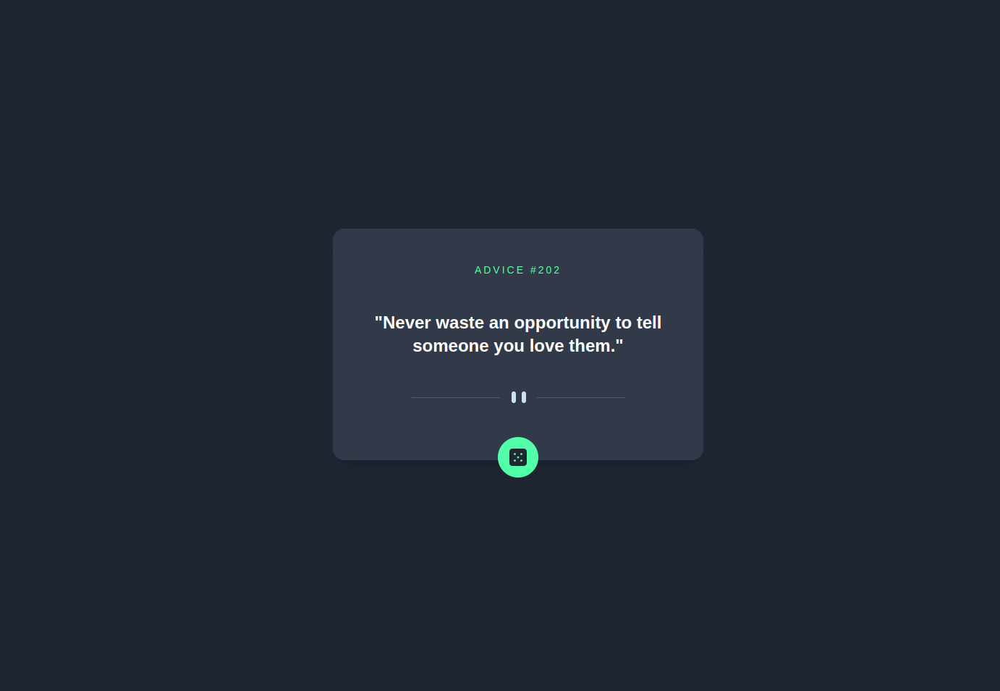

# Advice Generator with Next.js and Tailwind CSS

## Table of Contents
- [Description](#description)
- [Features](#features)
- [Demo](#demo)
- [Technologies Used](#technologies-used)
- [Installation](#installation)
- [Usage](#usage)
- [Contributing](#contributing)
- [License](#license)

## Description
This project is an advice generator web application built with Next.js and Tailwind CSS. It fetches random pieces of advice from the [Advice Slip API](https://api.adviceslip.com/advice) and displays them to users. The project was created as a challenge from Frontend Mentor.

## Features
- Generate random pieces of advice on various topics.
- Minimalistic and responsive user interface.
- Built with Next.js for server-side rendering and optimized performance.
- Styled with Tailwind CSS for rapid development and easy customization.

## Demo
[Live Demo](#) 

## Technologies Used
- Next.js
- Tailwind CSS

## Installation
To run this project locally, follow these steps:
1. Clone the repository: `git clone https://github.com/malek-bt/advice-generator.git`
2. Navigate to the project directory: `cd advice-generator`
3. Install dependencies: `npm install`

